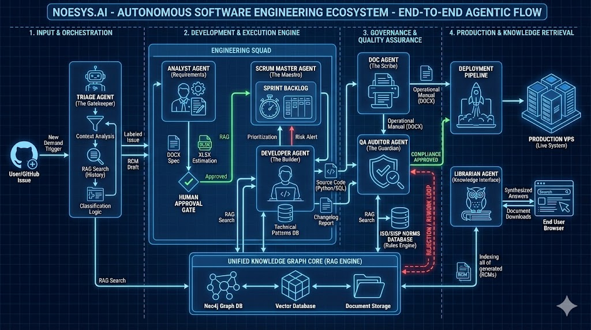

# 🤖 Catálogo de Agentes do Sistema noesys.ai

Abaixo, os agentes estão organizados conforme sua função no ciclo de vida da demanda.

## 1. Agente Classificador (Triage Agent)

**Função Principal:** É o "Porteiro Inteligente". Ele monitora a entrada de novas demandas (Issues no GitHub) em tempo real.
**Papel no RAG:** Utiliza o RAG para entender o contexto da solicitação (comparando com problemas passados) e classificar a demanda.
**Ações:**

- Identifica o tipo da demanda: Evolutiva (nova feature), Corretiva (bug), Operacional, ou Dúvida.
- Define a prioridade inicial.
- Aplica as labels corretas no GitHub (ex: `tipo:evolutiva`, `status:aguardando-validacao-rcm`).
- Se for Evolutiva, gera automaticamente um Rascunho de RCM (Relatório de Controle de Mudança) nos comentários.

## 2. Agente Analista (Analyst Agent)

**Função Principal:** Atua como um Analista de Requisitos Sênior. É responsável por detalhar e especificar tecnicamente as demandas complexas (Evolutivas).
**Papel no RAG:** Consulta intensamente a Base de Conhecimento (manuais, regras de negócio, histórico de tickets) para garantir que a especificação esteja correta e alinhada com o sistema legado.
**Ações:**

- Refina o escopo da RCM.
- Realiza a estimativa preliminar de esforço (Pontos de Função - PF) com base no histórico.
- Gera o documento físico da RCM (DOCX) e a Memória de Cálculo inicial (XLSX) para aprovação do cliente.

## 3. Agente Desenvolvedor (Dev Agent)

**Função Principal:** É o "Operário" da fábrica. Executa a codificação e alteração técnica no sistema alvo (Simulador RH-Gov).
**Papel no RAG:** Utiliza o RAG Técnico para buscar padrões de código do projeto ("Como faço um CRUD aqui?"), garantindo que o código novo siga a arquitetura existente.
**Ações:**

- Lê arquivos do projeto.
- Escreve e modifica código (Python/FastAPI/SQLModel).
- Gera o "Relatório de Mudanças" detalhando quais arquivos foram tocados.
- Move a issue para revisão técnica (`status:aguardando-review-tecnico`).

## 4. Agente de Qualidade (QA Agent / Auditor)

**Função Principal:** É o "Guardião da Governança". Garante que nada entre em produção sem estar em conformidade com as normas.
**Papel no RAG:** Sua base de conhecimento é composta pelas normas ISO/IEC (9001, 27001, 25000, 12207) e pelos Guias de Contagem de PF do SISP. Ele usa o RAG para auditar os artefatos gerados contra essas regras.
**Ações:**

- **Validação de Documentação:** Lê os Manuais Operacionais gerados e verifica clareza, segurança (ex: senhas expostas) e formatação.
- **Bloqueio de Deploy:** Se encontrar não-conformidades, bloqueia o processo e devolve para retrabalho.
- **(Futuro) Auditoria de PF:** Validará a contagem de Pontos de Função nas Memórias de Cálculo.

## 5. Agente de Documentação (Doc Agent)

**Função Principal:** Responsável por manter a base de conhecimento viva e atualizada.
**Papel no RAG:** Ele não apenas consome, mas alimenta o RAG. Ele transforma o conhecimento técnico (código) em conhecimento de negócio (manuais).
**Ações:**

- Gera ou atualiza Manuais Operacionais (DOCX) automaticamente após cada deploy.
- Gera o artefato físico da RCM e da Memória de Cálculo.
- Salva cópias dos documentos tanto no sistema alvo quanto no repositório central para indexação futura.

## 6. Agente Bibliotecário (Librarian Agent)

**Função Principal:** É o interface de acesso ao conhecimento para os usuários humanos.
**Papel no RAG:** É a personificação do RAG de busca. Ele indexa, organiza e recupera informações de toda a documentação gerada.
**Ações:**

- Permite busca semântica ("Como cadastro um servidor?") na página de Documentação.
- Gera resumos automáticos de documentos longos.
- Facilita o download de artefatos (PDF/DOCX).

## 7. Agente Scrum Master (SM Agent)

**Função Principal:** O "Maestro" do fluxo e do tempo. Garante a cadência e a previsibilidade.
**Papel no RAG:** Utiliza dados históricos do banco (Neo4j) para calcular a capacidade do time (Velocity) e prever riscos.
**Ações:**

- **Planejamento de Sprint:** Seleciona tarefas do backlog baseadas na capacidade do time e prioridade (SLA).
- **Monitoramento Diário:** Verifica o tempo de vida das issues e aplica labels de risco (`risco:sla-iminente`) se estiverem atrasadas.
- **Fechamento de Ciclo:** Gera relatórios de Sprint e PDCA ao final do período.

---

## Resumo da Interação

| Agente             | Entrada (Gatilho)   | Ação Principal       | Saída (Artefato)                  |
| ------------------ | ------------------- | -------------------- | --------------------------------- |
| **Classificador**  | Nova Issue (GitHub) | Triagem e Roteamento | Label + Rascunho RCM              |
| **Analista**       | Validação Humana    | Detalhamento Técnico | RCM (DOCX) + Memória (XLSX)       |
| **Desenvolvedor**  | Aprovação Cliente   | Codificação          | Código Fonte + Relatório Mudanças |
| **Documentador**   | Código Pronto       | Escrita Técnica      | Manual Operacional (DOCX)         |
| **Qualidade (QA)** | Manual Gerado       | Auditoria (ISO/SISP) | Veredito (Aprova/Bloqueia)        |
| **Bibliotecário**  | Consulta Usuário    | Busca e Síntese      | Resposta/Link Documento           |
| **Scrum Master**   | Cronograma/Tempo    | Gestão de Fluxo      | Sprint Backlog + Alertas Risco    |
